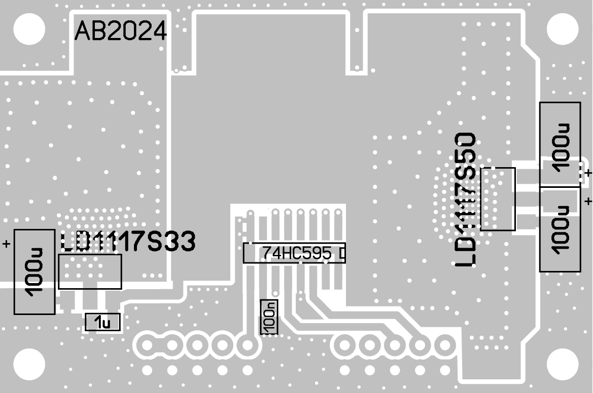
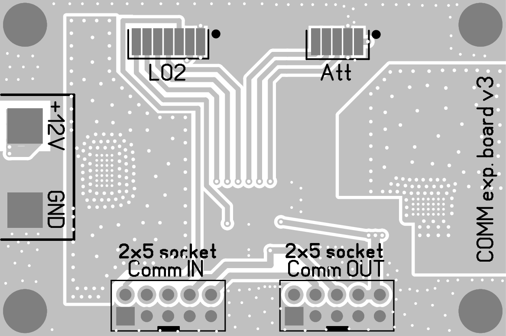
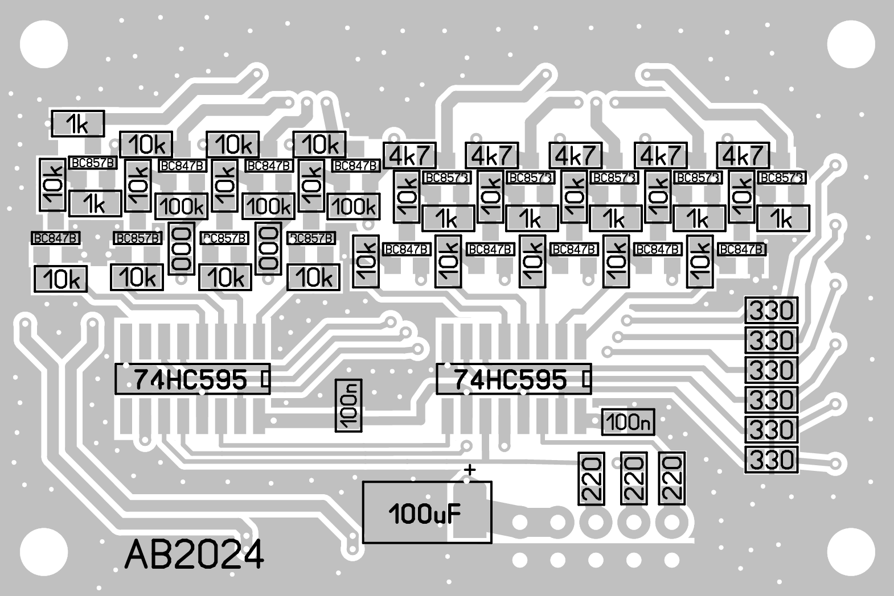
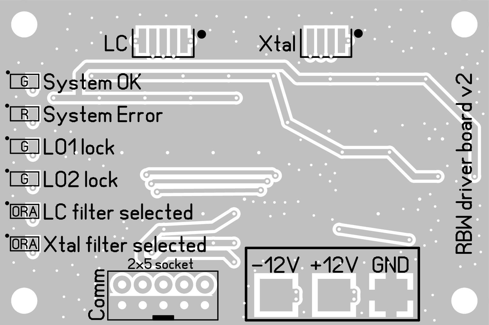

# Communication BUS

## Quick links
* [Communication board 1 schematic](Driver_board_1_schematic.svg)
* [Communication board 1 gerber](gerber/COMM-driver-board-1-v3.zip)
* [Communication board 2 schematic](Driver_board_2_schematic.svg)
* [Communication board 2 gerber](gerber/COMM-driver-board-2-v2.zip)

## LO2 and Attenuator communication

The spectrum analyzer incorporates over 50 digital connections. While the microcontroller pin count is not a limiting factor, the complexity of managing numerous interconnected components across the instrument is. To simplify maintenance and reduce the load on the microcontroller, I've implemented a common bus system.

Components like input/output attenuators, local oscillators, and bandpass filters, which require infrequent updates, are connected to this bus. By using multiple 74HC595 shift registers, I've condensed 17 connections into just 6. The circuit is divided for easier installation and features independent data writing for each section.

The second local oscillator and attenuators demand the most data, handled by the first shift register with a dedicated latch. The microcontroller directly accesses MAX2870 register readings for status monitoring and error reporting.

A separate voltage regulator efficiently converts the +12V input to +5V and +3.3V, reducing heat generation in the local oscillators. The two-layer FR4 PCB with vias ensures adequate heat dissipation. Noise suppression is handled within the component blocks, eliminating the need for additional filtering on the board. The communication bus is accessible through 10-pin SIP connectors and a flat flex cable for easy servicing. Schematics and component layout are included for reference.

## RBW driver

Bandwidth selection for the LC and crystal filters is achieved by controlling the voltage applied to PIN diodes. The filter types have distinct requirements: the LC filter demands a low-impedance path to +12V for bandwidth adjustment, while minimal current flows through the diodes at negative voltages. Conversely, the crystal filter necessitates a low-impedance path to -12V for bandwidth control, with negligible diode current at positive voltages.

To fulfill these needs, a control circuit employing NPN and PNP transistors has been developed. This circuit simultaneously converts input voltages ranging from 0 to 3.3V to the required -12V and +12V outputs. Transistor currents are minimized to optimize filter performance, although the transistors may exhibit slight warmth during operation. The circuit is fabricated on a 1.6 mm thick, two-layer FR4 laminate. The corresponding circuit diagram and component layout are presented in the following figures.

