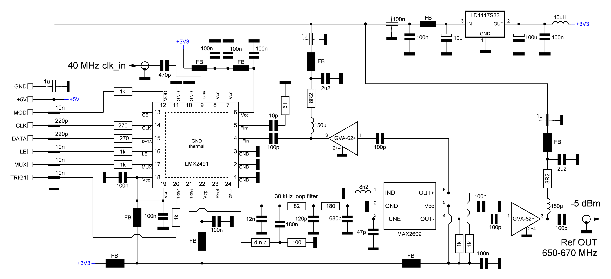
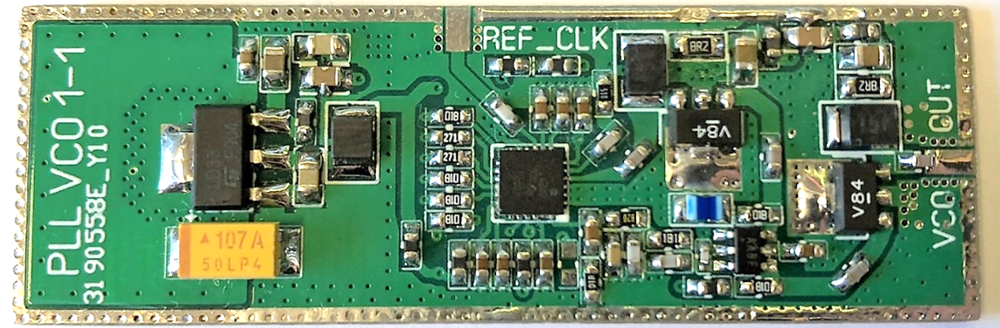
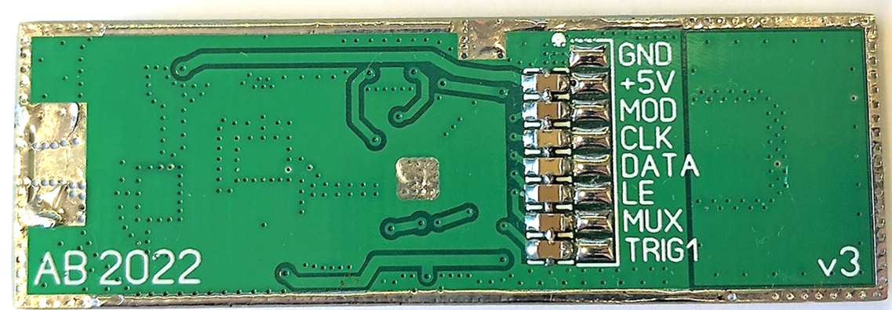
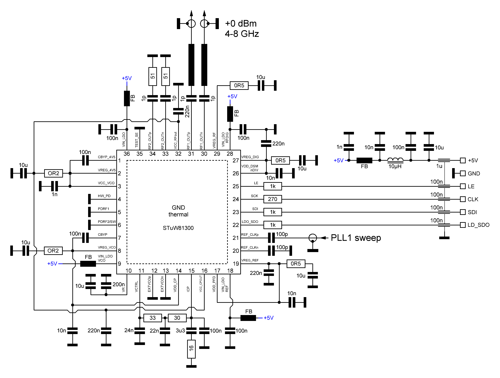
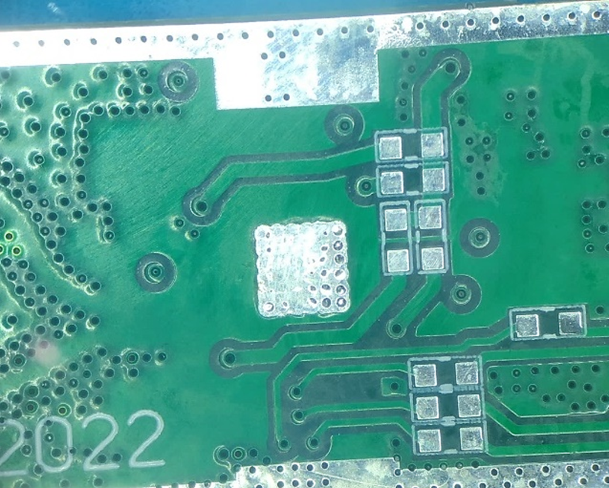
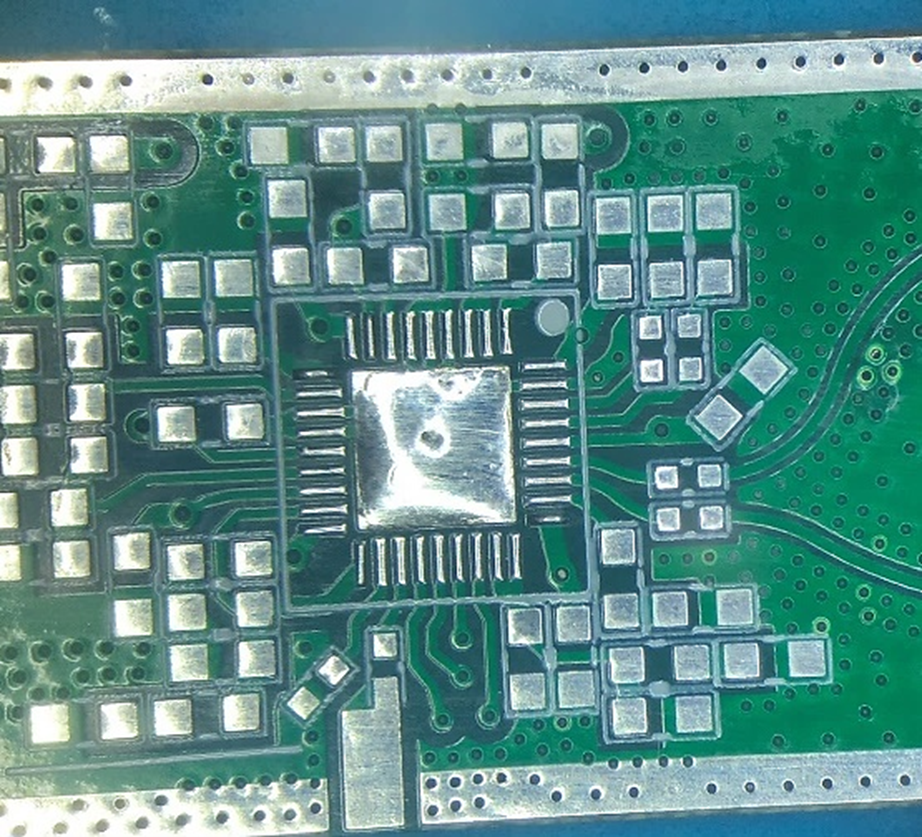
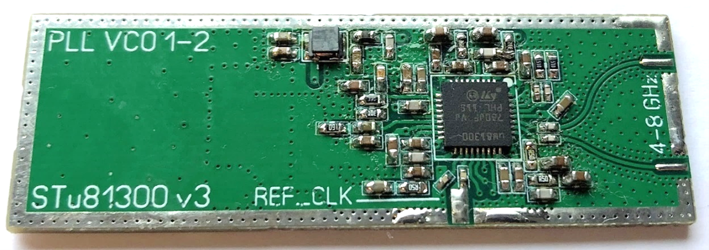

# Wide-Band Low Phase-Noise Signal Generation Using Coaxial Resonator in Cascaded Phase Locked Loop (LO1)

## Quick links
* [PLL 1-1 schematic](LO_1-1_schematic.png)
* [PLL 1-1 gerber](gerber/LO_1-1/pll_vco_1_1.zip)
* [PLL 1-2 schematic](LO_1-2_schematic.png)
* [PLL 1-2 gerber](gerber/LO_1-2/PLL_VCO_1_2_1v3.zip)

## Local Oscillator Design in RF Spectrum Analyzers

The local oscillator (LO) is a critical component in any RF spectrum analyzer. Its frequency range dictates the design of subsequent stages, while its phase noise directly limits achievable frequency resolution. Traditional YIG oscillators offer good phase noise (that gives around 1 kHz of frequency resolution), but suffer from slow response and high cost. Voltage-controlled oscillators (VCOs) with varicap diodes provide a more affordable alternative, albeit with poorer phase noise (approximately 10 kHz resolution). Achieving higher frequency resolution requires a fast phase-locked loop (PLL) for improved oscillator stability.

YIG oscillators necessitate complex two-coil control due to their sluggish response, making them unsuitable for cost-sensitive instruments. Consequently, VCOs with varicap diodes become the preferred choice. In designs without harmonic mixing, the LO bandwidth must match the maximum measurable input frequency. Generating such a wideband signal from a single oscillator poses a significant design challenge.

Microstrip implementations using discrete components offer limited frequency ranges (less than 5 GHz) and narrow tuning bandwidths (arround 2 GHz). The industry has addressed this limitation by utilizing semiconductors like gallium arsenide (GaAs) in integrated circuits (ICs). These ICs boast four times the electron mobility of silicon, leading to improved varactor Q-factor. Consequently, they can cover frequencies exceeding 6 GHz and reach sufficient output powers above 20 GHz. Additionally, their simple voltage control facilitates PLL integration. However, their high cost, often exceeding the combined expense of all other instrument components, and fragile ceramic packaging necessitate careful handling during installation.

An alternative approach for achieving wide sweeps involves employing multiple narrowband silicon oscillators operating at distinct frequencies. Electronic switching between these oscillators allows coverage of a broader frequency band. Discrete oscillators can be constructed separately and switched using PIN diodes, but the industry has readily adopted integrated solutions. The widespread availability of silicon technology translates to lower manufacturing costs and smaller chip sizes. This allows fabrication of numerous narrowband oscillators on a single wafer, which can be electronically combined to achieve a wideband output.

Recent advancements have brought forth PLL ICs featuring integrated oscillators with good phase noise characteristics (using silicon technology). These cost-effective solutions integrate the PLL on the same chip, eliminating complex high-frequency control circuitry and demanding printed circuit board (PCB) design. In contemporary LO design, these integrated PLL-oscillator ICs represent the optimal choice. They can be mounted on a suitable PCB and digitally controlled via a microcontroller, simplifying the overall design process.

## First LO

To achieve the widest possible spectrum analyzer frequency range, a high-frequency oscillator exceeding the analyzer's upper input limit is required. Doubling the high-frequency output for wider coverage is undesirable as it introduces subharmonics difficult to filter with high-pass sieves and impractical for home-built setups.

Commercially available options include the STuW81300 and LMX2594. The LMX2594 offers excellent performance between 7.5 GHz and 15 GHz, fractional mode operation, and automatic frequency hopping, but has experienced a two-year supply shortage. The STuW81300 achieves higher frequencies through baseband doubling (4 GHz - 8 GHz), supports fractional mode (albeit with a lower 21-bit resolution compared to the LMX2594's 32-bit), and lacks automatic hopping. However, it boasts a high reference clock input frequency (800 MHz) and a significantly lower price (one-third of the LMX2594).

Fractional-mode operation in the first local oscillator's PLL is less favorable. The sigma-delta modulator introduces unwanted signals in the output spectrum, typically suppressed by the loop filter. However, suppression becomes ineffective for fractions close to integer values, degrading mixer response and increasing phase noise. This can be addressed through a two-stage frequency adjustment approach. The PLL's main oscillator remains in integer mode, while changing the reference signal provides finer frequency resolution. A high phase detector clock frequency is desirable (with reference clock division if exceeding 100 MHz) as it simplifies loop filter design and improves phase noise.

The reference clock can be generated by a dedicated DDS synthesizer or an external VCO. However, DDS circuits for frequencies above 45 MHz generate significant heat, requiring effective thermal dissipation through the package underside. This becomes problematic in the closed, shielded enclosures often used for prototype development, leading to chip overheating.

An alternative option involves an additional, independent PLL. The STuW81300's 800 MHz input clock limit allows for a high-frequency reference clock oscillator. This, combined with internal division, enables a fast phase detector operating near the 100 MHz upper limit.

Following extensive prototyping, the final design employs a MAX2609 oscillator at a 640 MHz center frequency controlled by an LMX2491 fractional PLL chip. The first local oscillator's block diagram is presented in the following figure.

The LMX2491 offers 24-bit fractional resolution. At the 20 MHz phase detector frequency provided by an external temperature-stabilized crystal oscillator (TXCO), the frequency step resolution is 1.1921 Hz. This translates to a resolution of approximately 12 Hz after multiplication by 10 in the second PLL to achieve a 6.5 GHz output frequency. The reference loop in fractional mode is maintained at half the integer multiplier value of the 40 MHz reference clock and is adjusted by one-third of the frequency step in either direction. As the STuW81300 phase detector has a 100 MHz maximum operating frequency, the reference clock is divided internally by 8 to obtain a comparator frequency of around 80 MHz, allowing for a tailored loop filter design. A microcontroller recalculates the appropriate settings for both loops to reach the desired output frequency and transmits these settings via two independent SPI buses. Notably, the STuW81300 is used in the baseband without any output frequency multiplication.

## 3.2.2.1	LMX2491 and MAX2609 – PLL 1-1

The figure below illustrates the reference signal generator schematic for the first local oscillator. A MAX2609 external oscillator feeds the LMX2491 PLL chip through a cascaded pair of GVA-62+ MMIC amplifiers, achieving an output power near 0 dBm. Alternative amplifiers with a gain of at least 25 dB at 650 MHz and a noise figure below 3 dB (NF < 3 dB) can be employed.

The circuit incorporates a dedicated +3.3 V voltage regulator and utilizes appropriate coils, blocking capacitors, and ferrite beads to mitigate unwanted signal ingress and egress. Surface-mount feed-trough capacitors filters signals comming in, while a 1.27 mm flat cable connector resides on the underside of the board. An 8.2 nH inductor with a high Q factor sets the oscillation frequency of the MAX2609. A 47 pF capacitor should be placed directly across the GND and TUNE pins.

X7R ceramic capacitors are used for values exceeding 100 nF. The 10 µH inductor preceding the voltage regulator must handle a continuous current exceeding 200 mA. The PCB can be either a self-made prototype or commercially produced on a standard two-layer FR4 substrate with a thickness of 1.6 mm. Thermal vias surrounding the amplifiers and voltage regulator ensure proper heat dissipation. When housed in a brass enclosure, the circuit maintains a stable temperature, with a maximum rise of 5°C above the ambient environment.

##	STuW81300 – PLL 1-2

The STuW81300, a relatively obscure integrated circuit (IC) from STMicroelectronics, offers a unique combination of functionalities. It houses a 21-bit sigma-delta modulator, a phase-locked loop (PLL) with a charge pump, and four voltage-controlled oscillators (VCOs) with 32 tuning bands each. This configuration enables frequency synthesis across a wide range, from 3.85 GHz to 8 GHz. An integrated amplifier stage boasts an output power of up to +4 dBm. The inclusion of five low-noise linear voltage regulators (LDOs) minimizes the requirement for external components, simplifying power management and potentially improving noise performance. However, this comes at the cost of increased heat generation compared to competing devices. Effective thermal dissipation is crucial to maintain optimal output power.

The intended operational mode for the chip is integer-N PLL with a phase detector frequency of approximately 80 MHz. Based on these specifications, the loop filter design incorporates appropriate blocking capacitors for the LDOs, as recommended by the manufacturer. The remaining external components primarily facilitate communication through the Serial Peripheral Interface (SPI) bus and ensure proper input voltage regulation. A detailed circuit diagram is provided in the subsequent figure.

The primary challenge lies in achieving efficient heat dissipation from the IC onto the printed circuit board (PCB). Two approaches are considered. The first involves utilizing a double-layer FR4 PCB with a thickness of 0.8 mm. This method incorporates a larger (2.5 mm) via in the ground plane beneath the chip, along with soldered copper strips on the bottom layer. These modifications aim to minimize thermal resistance by maximizing contact area with the ground plane and facilitating heat transfer. A superior solution is achieved by employing a 4-layer FR4 PCB with a thickness of 1.6 mm, commonly used in industrial settings. This configuration utilizes the inner layers as extensive copper planes for enhanced heat dissipation towards the enclosure. Notably, all exposed thermal vias on the chip's bottom side are completely tin-plated prior to soldering, as depicted in figure below.

Under continuous operation at room temperature, this approach, employing a sealed brass case, results in a case temperature of approximately 45 °C and a chip surface temperature of around 70 °C. Importantly, this method avoids any output power reduction or noise degradation. Conversely, utilizing a double-layer PCB leads to a chip surface temperature exceeding 90 °C, accompanied by a decrease in output power and a slight increase in phase noise over extended operation.

## Producing broadband frequency sweep

While a well-designed high-frequency circuit for the first local oscillator (LO) is crucial, its full potential is unrealized without appropriate microcontroller software. The LMX2491 PLL (reference branch) chip enables automatic fractional-N frequency sweeping. It functions as a simple state machine, incrementing the fractional value by a predefined step size based on the phase detector clock or an external signal. We leverage this for narrow frequency sweeps. After configuring the chip registers, we provide an external clock that determines the output frequency change rate for the chosen fractional value, defining the step size. This translates to a step-wise change in the output frequency of the STuW81300 chip, multiplied by its divider N value.

However, limitations arise for sweeps exceeding 80 MHz. Here, switching between multiple STuW81300 oscillators becomes necessary. These oscillators, numbering up to 128, cover wide frequency ranges (typically ∆f ≈ 300 MHz). In the best case (higher frequencies, around 8 GHz), this range can reach ∆f ≈ 460 MHz, while the worst case (lower frequencies, around 4 GHz) sees a ∆f ≈ 220 MHz range. This ensures that even with a full fractional step in the reference clock, we remain within at least one oscillator's range. In reality, significant overlap between these ranges further enhances reliability.

The STuW81300 chip internally handles oscillator selection and fractional loop divider N setting, requiring approximately 13 cycles of the ~1 MHz calibration clock (exact frequency depends on the reference signal). Therefore, unless bypassing the calibration procedure (which momentarily disrupts the output frequency), oscillator selection is automatic. In such cases, calibration is performed once, and the chosen settings are stored in the microcontroller's memory for later recall when updating the N counter value in the PLL chip. Extensive testing revealed that this approach is unnecessary and can even impede wide frequency sweeps due to the constant need to adjust N bank-oscilattors settings.

An additional challenge arises from the N divider's limitation: a maximum input frequency of 6 GHz (practically 7.2 GHz). For higher frequencies, an additional /2 divider becomes necessary, effectively doubling the chosen N value. At lower output frequencies, changing the phase detector frequency by ~80 MHz (PLL 1-1) doesn't cover the entire 160 MHz range. Here, the additional /2 divider needs to be dynamically enabled.

The microcontroller software's key function then becomes real-time recalculation of the N divider value for PLL 1-2 and the fractional value F for PLL 1-1. The fractional value F is updated in pre-defined steps based on the desired number of points and frequency sweep size. Communication with the LMX2491 chip via SPI occurs only during integer N value changes, with the fraction automatically updated within the chip. For frequencies below 6 GHz, fractional values cover at least 80 MHz, and at least 160 MHz above 6 GHz. The calculation for the LO output frequency and selection of N and F values are performed using the equations provided below.

**Frequency below 6 GHz**
$$f_{out} [MHz]=80 N+\frac{20}{8}N\frac{F}{2^{24}}$$

**Frequency above 6 GHz**
$$f_{out} [MHz]=160 N+5N\frac{F}{2^{24}}$$

The equations demonstrate that the frequency step size is directly proportional to the divider setting (N) and exhibits minimal values at lower frequencies. Switching limits ensure the fractional component (F) of the output frequency (F_OUT) remains within ∆f (2.5 MHz) of the PLL 1-1 integer value. This effectively suppresses unwanted products generated by the sigma-delta modulator through loop filtering.

During configuration, including adjustments to F within the LMX2491, the microcontroller awaits successful phase lock confirmation signals from both loops before initiating power sampling through the selected bandpass filter. Sweep speed is bandwidth-dependent; narrow bandwidths are filter-limited, while the widest range (RBW 3 MHz) experiences limitations due to the combined loop settling times. In the prototype, the maximum sweep time for the full 4 GHz range with the widest (3 MHz) inter-frequency sieve is approximately 137 ms, primarily due to user interface data processing constraints.

Selecting a new N counter value and awaiting the phase lock signal takes roughly 41 μs. Setting the fractional value (F) is even faster, as most adjustments fall within the PLL 1-1 loop filter bandwidth. Resuming frequency sweeping after modifying N (resulting in a PLL 1-1 oscillator frequency shift of ~17 MHz) incurs an additional 8.5 μs turn-on delay before setting the PLL 1-2 integer values. During this power-on wait, the microcontroller software calculates new settings and writes them to the PLL shadow registers. Theoretically, a single frequency sweep could be completed in less than 25 ms; however, practical implementation necessitates doubling this time to mitigate digital communication interference.